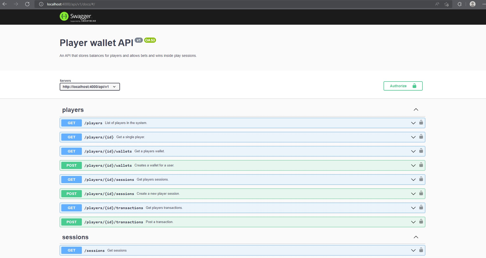

# Player wallet API

This API enables players to create new wallets and open sessions. If a player has a wallet and a open sesion he can post a new transaction that simulates a betting or withdrawal event.

## Prerequisites

Tested with:

- node version 14.16.0
- typescript version 4.5.5

## Setup

1. Rename .env.example to .env and select the desired environment by changing NODE_ENV to test, development or production. This is important because the initialization scripts that need run be in the next steps depend on the selected environment. The test env has some dummy data and is easier to manually test the api wih. The production and development scripts only have players.
2. Run docker-compose up -d
3. npm install
4. npm run init-db
5. npm run build
6. npm start
7. Go to the address defined in the .env file. Default address is: localhost:4000

## Troubleshooting

I developed this on linux. On microsoft windows you need to manually copy .sql files from src folder to appropraiate location in dist folder after build.

## Authorization

The application has two types of users. A single admin user that can see information from all players and standard users (players) that can only see their data. The authorization is done via basic authorization and the passwords are stored in src/password.json

## API documentation

Api documentation is available on ./api/v1/docs

## API versioning

There is a master branch for development and v1 branch for development of version 1 of the api.
